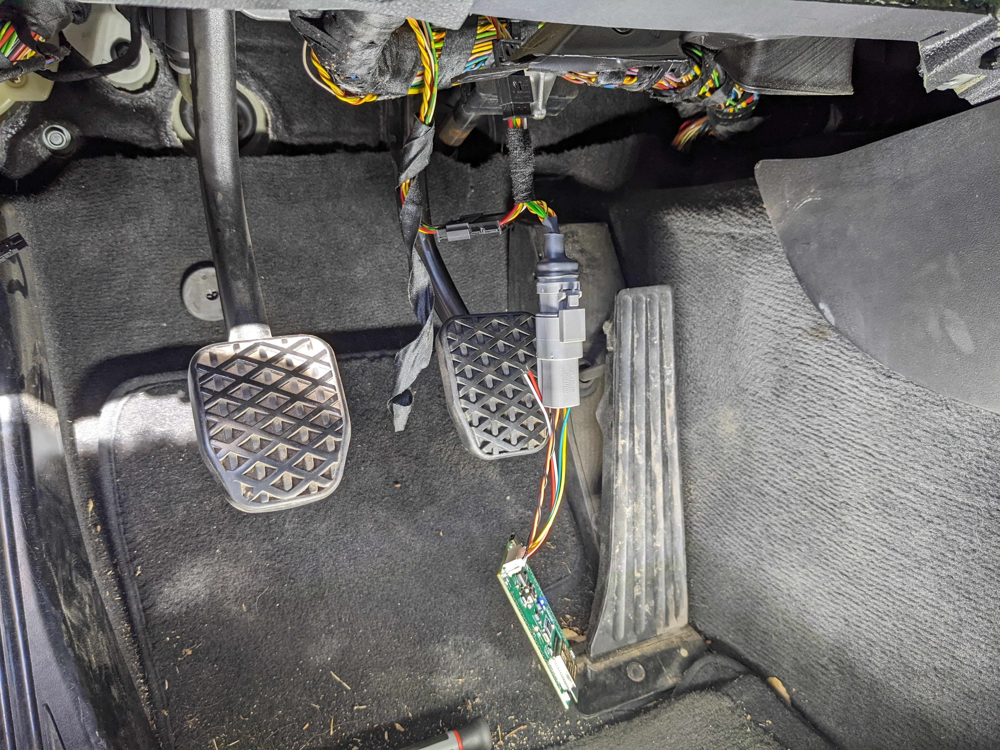
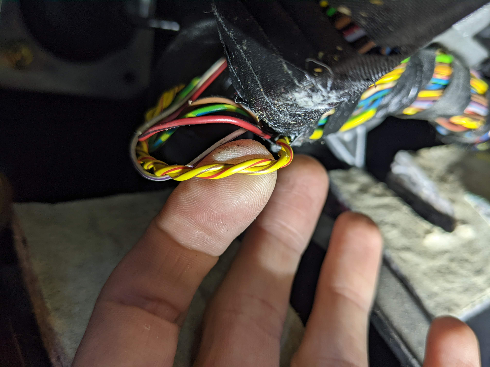
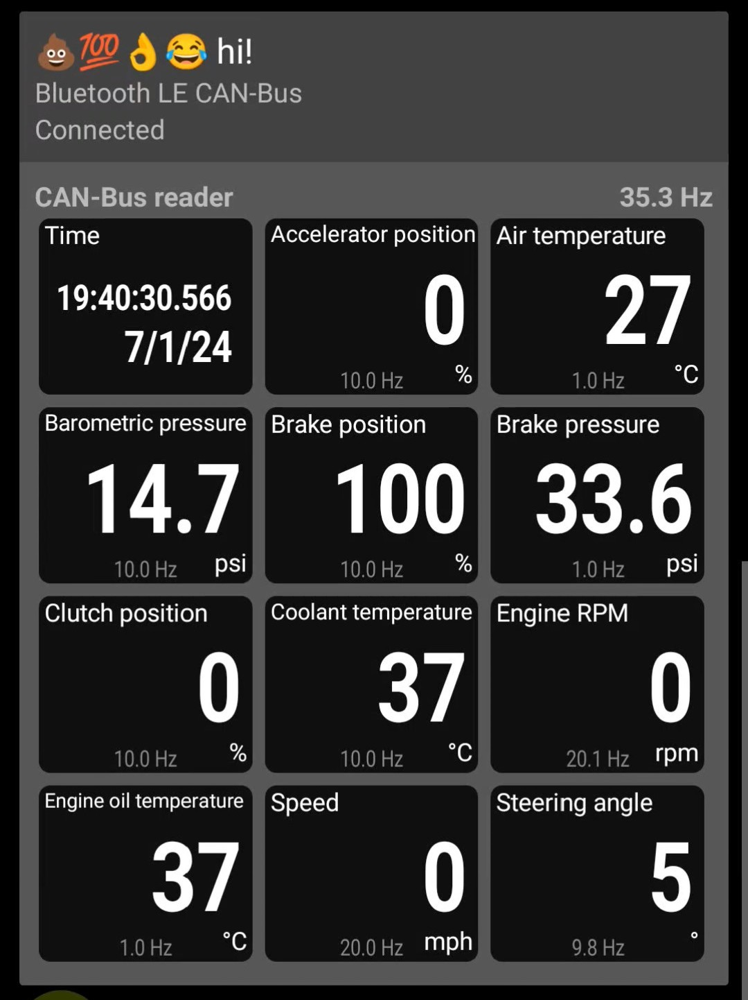

# CAN Bus Data Logger for RaceChrono

This project is a high-speed CAN-Bus datalogger for a BMW Z4 E85. It integrates into the onboard network and feeds data to [RaceChrono](https://racechrono.com/) over Bluetooth Low Energy (BLE).

## TODOs

## BoM

- ASL [ESP32-CAN-X2](https://www.autosportlabs.com/product/esp32-can-x2-dual-can-bus-automotive-grade-development-board/)
- Tulay's Wire Werks [E46 CAN-Bus Plug and Play Adapter](https://tulayswirewerks.com/product/e46-can-bus-plug-and-play-adapter-4-pin-ign/)

## Pictures

