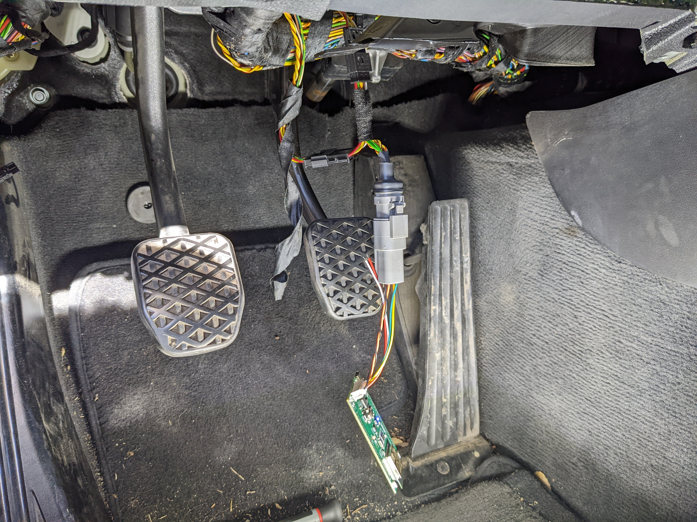
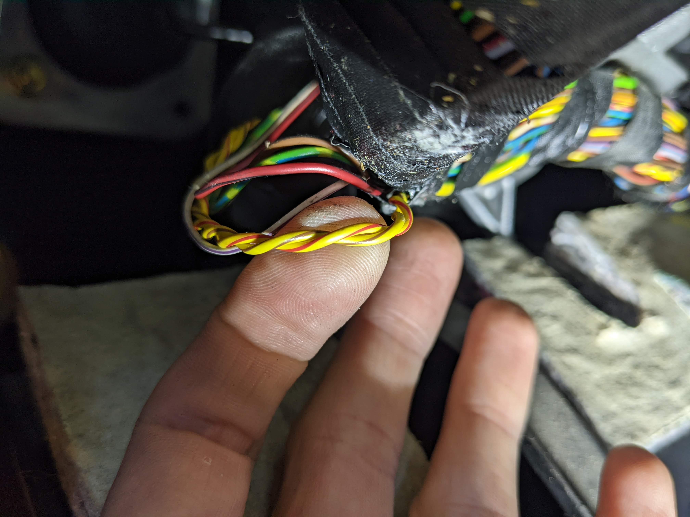
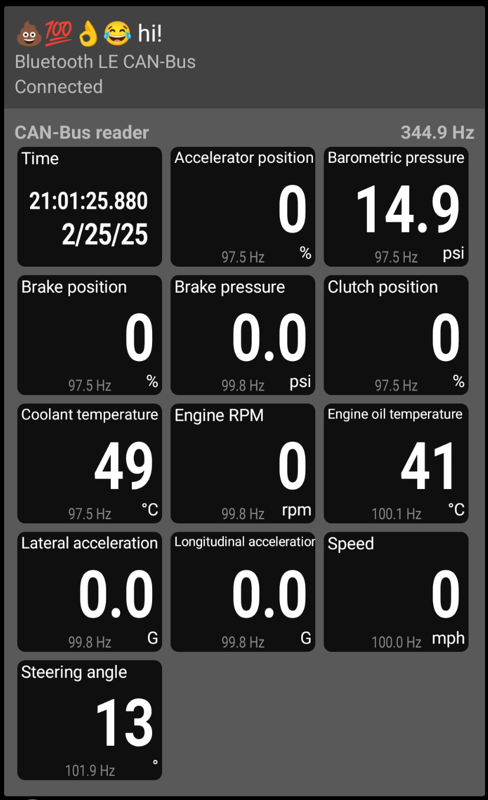
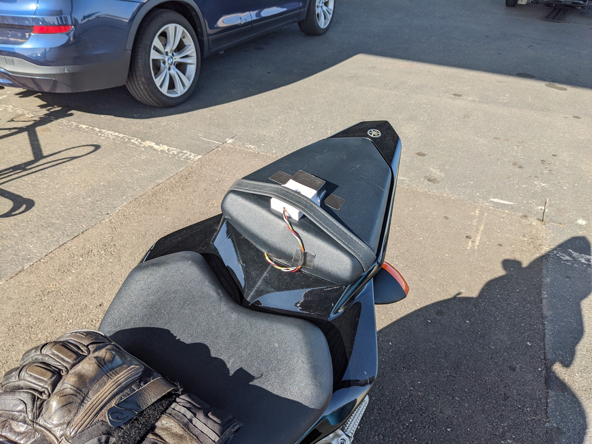

# CAN Bus Data Logger and GPS for RaceChrono

This project is a high-speed CAN-Bus datalogger and >10Hz GPS for the BMW Z4 E85.
It integrates into the onboard network and feeds data to
[RaceChrono](https://racechrono.com/) over Bluetooth Low Energy (BLE).

## TODOs

- [x] High-speed GPS module
- [x] Upload 3d printed enclosure .stl files and pictures
- [ ] Bluetooth security
- [x] Update rate improvements
  - [ ] Merge CAN messages?
- [x] XY-Axis acceleration data
  - [x] Formulas/decoding needs to be fixed

## Bill of Materials

- ASL [ESP32-CAN-X2](https://www.autosportlabs.com/product/esp32-can-x2-dual-can-bus-automotive-grade-development-board/)
- ASL [GPS Add-On](https://www.autosportlabs.com/product/gps-bolt-on/)
- Tulay's Wire Werks [E46 CAN-Bus Plug and Play Adapter](https://tulayswirewerks.com/product/e46-can-bus-plug-and-play-adapter-4-pin-ign/)
- [3D printed enclosure](3d_printing) (SLS nylon)

## Pictures and Videos

[](https://www.youtube.com/watch?v=Rh_8cXntPHk)

CAN data logger in action at Thunderhill West.

[](https://www.youtube.com/watch?v=qSwpusbHHVU)

GPS module in action on a Yamaha R6 at Thuderhill East. 










GPS module on the back of a Yamaha R6. No CAN input, obviously.

## Achieving high BLE notification throughput

To achieve high CAN message throughput, the following things should be considered,
roughly in order of importance:

- Ensure that there are free BLE transmit buffer available before sending (`esp_ble_get_cur_sendable_packets_num`)
- Set the connection intervals low on the server side (`esp_ble_gap_update_conn_params`)
- Request HIGH connection priority on the client side
- Choose 2M BLE PHY over 1M or CODED PHY
- Set BLE MTU higher than message size + 4
- Run freeRTOS CAN and BLE tasks with higher than 0 (IDLE) priority
- Use a **fast** CAN ARBID filter function
- Set the TX power to a high enough setting, depending on distance to phone
- Filter out uninteresting CAN ARBIDs in hardware

## Accelerometer data from CAN ASC3 (0x1F3/499) message

The traction and stability control module (DSC/ASC) in the Z4 comes
with a 2D accleration sensor. Its data is transmitted over the CAN
bus as part of the 0x1F3/499 message. While the specific fields/bytes
containing the X and Y acceleration data are known, the exact
conversion formulae are not. The following is my attempt at parsing
the data experimentally, based on traces recorded in a controlled
environment (a parking lot) and correlating the data with the
accelerometer in my phone.

```
8 byte ASC3 CAN payload:
    A  B  C  D  E  F  G  H
0x 00 00 00 00 00 00 00 00

Longitudinal (Y axis, forward/backward, in m/s^2): ((((E & 0x03) << 8) | D) - 512) / 32.

Lateral (X axis, sideways, in m/s^2): (((F << 2) | ((E & 0xC0) >> 6)) - 512) / 20.
```


Reference: [MS43 Wiki CAN ASC3](https://www.ms4x.net/index.php?title=CAN_Bus_ID_0x1F3_ASC3)

## Android connection priority / BLE connection interval

_Note: this section is outdated. There is an API for setting the connection
interval on the server side._

The BLE stack operates on two connection interval values (min, max), which
effectively determine the maximum possible update rate for CAN-bus messages
transmitted from the ESP32 device to the phone. While we can set the _preferred_
values on the server side with `pAdvertising->setMinPreferred(0x06);`, it's the
client (phone) which ultimately chooses the values. By default, my Android Pixel
4 seems to pick a balanced value resulting in a update rate of ~30-40 Hz. Apps
can explicitly request a priority for a given connection [docs](https://developer.android.com/reference/android/bluetooth/BluetoothGatt#requestConnectionPriority(int)), picking between 4 presets.

In my experiments I used the [nRF Connect](https://play.google.com/store/apps/details?id=no.nordicsemi.android.mcp)
app to both log and set BLE parameters. When following these steps, I could
significantly increase the observed CAN message rate:

0) Enable Bluetooth
1) Open nRF Connect app and connect to data logger
2) From drop-down, open "Request connection priority" and pick `HIGH`
3) Confirm change in logs
4) Open Racechrono
5) Start new recoding session
6) Open sensor menu `^` and confirm "Bluetooth LE CAN-bus" update rate

Here are the different rates observed with different settings:

| Connection Prio | Data Rate [Hz] |
|-----------------|----|
| default         | ~45 |
| HIGH            | >60 |
| BALANCED        | ~45 |
| LOW_POWER       | 7 |

## Credits / References
- https://github.com/autosportlabs/ESP32-CAN-X2
- https://github.com/aollin/racechrono-ble-diy-device
- https://www.ms4x.net
